# Supabase 전체 구조 문서

> **최종 스캔일**: 2026-02-13  
> **DB 버전**: PostgreSQL 17  
> **마이그레이션 파일 수**: 36개  
> **프로젝트 ID**: `saas-template`

---

## 목차

- [1. Table & Column](#1-table--column)
- [2. RLS (Row Level Security)](#2-rls-row-level-security)
- [3. Trigger & Function](#3-trigger--function)
- [4. Storage](#4-storage)
- [5. Auth (인증)](#5-auth-인증)
- [6. 외부 API 연결 지표](#6-외부-api-연결-지표)
- [부록: Mermaid ER Diagram](#부록-mermaid-er-diagram)

---

## 1. Table & Column

> 총 28개 테이블 (예시 테이블 2개 포함), 5개 ENUM 타입, 2개 View

### ENUM 타입 정의

| ENUM 타입 | 값 | 설명 |
|-----------|-----|------|
| `user_role` | `BUYER`, `SELLER`, `consumer`, `producer`, `admin`, `super_admin` | 사용자 역할. BUYER/SELLER는 레거시, consumer/producer로 마이그레이션됨 |
| `product_status` | `AVAILABLE`, `RESERVED`, `SOLD`, `SOLD_OUT` | 상품 상태 |
| `order_status` | `RESERVED`, `COMPLETED`, `CANCELED` | 주문 상태 |
| `completion_type` | `SELLER`, `AUTO` | 구매확정 처리 주체 |
| `product_category` | `빵`, `도시락`, `음료`, `디저트`, `과일`, `채소`, `정육`, `수산물`, `반찬`, `기타` | 상품 카테고리 (ML 예측 피처용) |

---

### `profiles`

> 용도: 사용자 프로필 (Clerk 사용자와 동기화)

| 컬럼명 | 타입 | Nullable | Default | FK | 설명 |
|--------|------|----------|---------|-----|------|
| `id` | UUID | NOT NULL | `gen_random_uuid()` | PK | 기본 키 |
| `clerk_id` | TEXT | NOT NULL | - | UNIQUE | Clerk User ID |
| `role` | user_role | NOT NULL | `'BUYER'` | - | 역할 |
| `nickname` | TEXT | YES | - | - | 닉네임 |
| `created_at` | TIMESTAMPTZ | NOT NULL | `now()` | - | 생성 시각 |
| `address` | TEXT | YES | - | - | 소비자 검색 기준 주소 |
| `latitude` | DOUBLE PRECISION | YES | - | - | 위도 |
| `longitude` | DOUBLE PRECISION | YES | - | - | 경도 |

INDEX:
- `idx_profiles_clerk_id` (`clerk_id`) — Clerk ID 조회
- `idx_profiles_location` (`latitude, longitude`) WHERE NOT NULL — 위치 기반 조회
- `idx_profiles_role` (`role`) — 역할별 조회

---

### `stores`

> 용도: 가게 정보

| 컬럼명 | 타입 | Nullable | Default | FK | 설명 |
|--------|------|----------|---------|-----|------|
| `id` | UUID | NOT NULL | `gen_random_uuid()` | PK | 기본 키 |
| `owner_id` | TEXT | NOT NULL | - | FK → `profiles(clerk_id)` CASCADE | 사장님 Clerk ID |
| `name` | TEXT | NOT NULL | - | - | 가게 이름 |
| `address` | TEXT | YES | - | - | 가게 주소 |
| `phone` | TEXT | YES | - | - | 전화번호 |
| `created_at` | TIMESTAMPTZ | NOT NULL | `now()` | - | 생성 시각 |
| `latitude` | DOUBLE PRECISION | YES | - | - | 위도 |
| `longitude` | DOUBLE PRECISION | YES | - | - | 경도 |
| `image_url` | TEXT | YES | - | - | 가게 대표 이미지 |

INDEX:
- `idx_stores_owner_id` (`owner_id`) — 사장님별 가게 조회
- `idx_stores_location` (`latitude, longitude`) WHERE NOT NULL — 위치 기반 조회

---

### `products`

> 용도: 마감 할인 상품

| 컬럼명 | 타입 | Nullable | Default | FK | 설명 |
|--------|------|----------|---------|-----|------|
| `id` | UUID | NOT NULL | `gen_random_uuid()` | PK | 기본 키 |
| `store_id` | UUID | NOT NULL | - | FK → `stores(id)` CASCADE | 가게 ID |
| `name` | TEXT | NOT NULL | - | - | 메뉴명 |
| `original_price` | INTEGER | NOT NULL | - | - | 정가 |
| `discount_price` | INTEGER | NOT NULL | - | - | 할인가 |
| `image_url` | TEXT | YES | - | - | 상품 이미지 URL |
| `is_instant` | BOOLEAN | YES | `FALSE` | - | 바로 섭취 여부 |
| `pickup_deadline` | TIMESTAMPTZ | NOT NULL | - | - | 픽업 마감 시간 |
| `status` | product_status | NOT NULL | `'AVAILABLE'` | - | 상품 상태 |
| `created_at` | TIMESTAMPTZ | NOT NULL | `now()` | - | 생성 시각 |
| `quantity` | INTEGER | NOT NULL | `1` | - | 재고 수량 |
| `template_id` | UUID | YES | - | FK → `menu_templates(id)` SET NULL | 메뉴 템플릿 |
| `weight_value` | DECIMAL | YES | - | - | 무게값 |
| `weight_unit` | TEXT | YES | `'g'` | - | 단위 (g/kg) |
| `early_access_from` | TIMESTAMPTZ | YES | - | - | 선공개 시작 시각 |
| `visible_from` | TIMESTAMPTZ | YES | - | - | 전체 공개 시각 |
| `category` | product_category | YES | `'기타'` | - | 상품 카테고리 |

CHECK: `weight_unit IN ('g','kg')`, `weight_value IS NULL OR weight_value > 0`

INDEX:
- `idx_products_store_id` (`store_id`) — 가게별 상품 조회
- `idx_products_status` (`status`) — 상태별 조회
- `idx_products_available` (`status, created_at`) WHERE `status = 'AVAILABLE'` — 판매중 상품
- `idx_products_created_at` (`created_at DESC`) — 최신순 정렬
- `idx_products_pickup_deadline` (`pickup_deadline`) — 마감 시간 필터
- `idx_products_status_deadline` (`status, pickup_deadline`) WHERE `status = 'AVAILABLE'` — 마감 임박 판매중
- `idx_products_quantity` (`quantity`) — 수량 기반 조회
- `idx_products_template_id` (`template_id`) — 템플릿별 상품
- `idx_products_weight` (`weight_value`) WHERE NOT NULL — 무게 기반 조회
- `idx_products_early_access` (`early_access_from`) WHERE NOT NULL — 선공개 상품
- `idx_products_visible_from` (`visible_from`) WHERE NOT NULL — 전체 공개 시각
- `idx_products_category` (`category`) — 카테고리별 조회

---

### `orders`

> 용도: 주문/예약 내역

| 컬럼명 | 타입 | Nullable | Default | FK | 설명 |
|--------|------|----------|---------|-----|------|
| `id` | UUID | NOT NULL | `gen_random_uuid()` | PK | 기본 키 |
| `buyer_id` | TEXT | NOT NULL | - | FK → `profiles(clerk_id)` CASCADE | 구매자 Clerk ID |
| `product_id` | UUID | NOT NULL | - | FK → `products(id)` CASCADE | 상품 ID |
| `status` | order_status | NOT NULL | `'RESERVED'` | - | 주문 상태 |
| `created_at` | TIMESTAMPTZ | NOT NULL | `now()` | - | 생성 시각 |
| `quantity` | INTEGER | NOT NULL | `1` | - | 주문 수량 |
| `preferred_pickup_time` | TIMESTAMPTZ | YES | - | - | 픽업 희망 시간 |
| `completed_at` | TIMESTAMPTZ | YES | - | - | 구매확정 시점 |
| `completed_by` | completion_type | YES | - | - | 확정 주체 (SELLER/AUTO) |
| `coupon_id` | UUID | YES | - | FK → `user_coupons(id)` SET NULL | 사용된 쿠폰 ID |

INDEX:
- `idx_orders_buyer_id` (`buyer_id`) — 구매자별 주문
- `idx_orders_product_id` (`product_id`) — 상품별 주문
- `idx_orders_created_at` (`created_at DESC`) — 최신순 정렬
- `idx_orders_completed_at` (`completed_at`) WHERE NOT NULL — 완료된 주문
- `idx_orders_coupon_id` (`coupon_id`) WHERE NOT NULL — 쿠폰 사용 통계

---

### `menu_templates`

> 용도: 사장님이 자주 쓰는 메뉴 템플릿

| 컬럼명 | 타입 | Nullable | Default | FK | 설명 |
|--------|------|----------|---------|-----|------|
| `id` | UUID | NOT NULL | `gen_random_uuid()` | PK | 기본 키 |
| `store_id` | UUID | NOT NULL | - | FK → `stores(id)` CASCADE | 가게 ID |
| `name` | TEXT | NOT NULL | - | - | 메뉴명 |
| `original_price` | INTEGER | NOT NULL | - | - | 정가 |
| `image_url` | TEXT | YES | - | - | 이미지 URL |
| `is_instant` | BOOLEAN | YES | `FALSE` | - | 바로 섭취 여부 |
| `created_at` | TIMESTAMPTZ | NOT NULL | `now()` | - | 생성 시각 |
| `updated_at` | TIMESTAMPTZ | NOT NULL | `now()` | - | 수정 시각 (트리거 자동) |
| `weight_value` | NUMERIC | YES | - | - | 무게/용량 |
| `weight_unit` | TEXT | YES | `'g'` | - | 단위 (g/kg/ml/L) |
| `category` | TEXT | YES | `'기타'` | - | 카테고리 |

CHECK: `weight_unit IN ('g','kg','ml','L')`

INDEX:
- `idx_menu_templates_store_id` (`store_id`) — 가게별 메뉴
- `idx_menu_templates_category` (`category`) — 카테고리별

---

### `cart_items`

> 용도: 소비자 장바구니

| 컬럼명 | 타입 | Nullable | Default | FK | 설명 |
|--------|------|----------|---------|-----|------|
| `id` | UUID | NOT NULL | `gen_random_uuid()` | PK | 기본 키 |
| `buyer_id` | TEXT | NOT NULL | - | FK → `profiles(clerk_id)` CASCADE | 구매자 Clerk ID |
| `product_id` | UUID | NOT NULL | - | FK → `products(id)` CASCADE | 상품 ID |
| `quantity` | INTEGER | NOT NULL | `1` | - | 수량 (CHECK >= 1) |
| `preferred_pickup_time` | TIMESTAMPTZ | YES | - | - | 픽업 희망 시간 |
| `created_at` | TIMESTAMPTZ | NOT NULL | `now()` | - | 생성 시각 |

UNIQUE: `(buyer_id, product_id)`

INDEX:
- `idx_cart_items_buyer_id` (`buyer_id`) — 구매자별 장바구니
- `idx_cart_items_product_id` (`product_id`) — 상품별

---

### `user_favorite_stores`

> 용도: 즐겨찾기 가게

| 컬럼명 | 타입 | Nullable | Default | FK | 설명 |
|--------|------|----------|---------|-----|------|
| `id` | UUID | NOT NULL | `gen_random_uuid()` | PK | 기본 키 |
| `user_id` | TEXT | NOT NULL | - | - | Clerk User ID |
| `store_id` | UUID | NOT NULL | - | FK → `stores(id)` CASCADE | 가게 ID |
| `created_at` | TIMESTAMPTZ | NOT NULL | `now()` | - | 생성 시각 |

UNIQUE: `(user_id, store_id)`

INDEX:
- `idx_favorite_stores_user_id` (`user_id`) — 사용자별
- `idx_favorite_stores_store_id` (`store_id`) — 가게별

---

### `reviews`

> 용도: 상품 리뷰

| 컬럼명 | 타입 | Nullable | Default | FK | 설명 |
|--------|------|----------|---------|-----|------|
| `id` | UUID | NOT NULL | `gen_random_uuid()` | PK | 기본 키 |
| `order_id` | UUID | NOT NULL | - | FK → `orders(id)` CASCADE, UNIQUE | 주문 ID |
| `buyer_id` | TEXT | NOT NULL | - | FK → `profiles(clerk_id)` CASCADE | 작성자 |
| `store_id` | UUID | NOT NULL | - | FK → `stores(id)` CASCADE | 가게 |
| `product_id` | UUID | NOT NULL | - | FK → `products(id)` CASCADE | 상품 |
| `rating` | INTEGER | NOT NULL | - | - | 별점 (CHECK 1~5) |
| `content` | TEXT | YES | - | - | 리뷰 내용 |
| `image_url` | TEXT | YES | - | - | 리뷰 이미지 |
| `created_at` | TIMESTAMPTZ | NOT NULL | `now()` | - | 생성 시각 |
| `updated_at` | TIMESTAMPTZ | NOT NULL | `now()` | - | 수정 시각 |

INDEX:
- `idx_reviews_store_id` / `idx_reviews_product_id` / `idx_reviews_buyer_id` / `idx_reviews_order_id`

---

### `review_replies`

> 용도: 사장님의 리뷰 답글 (리뷰당 1개)

| 컬럼명 | 타입 | Nullable | Default | FK | 설명 |
|--------|------|----------|---------|-----|------|
| `id` | UUID | NOT NULL | `gen_random_uuid()` | PK | 기본 키 |
| `review_id` | UUID | NOT NULL | - | FK → `reviews(id)` CASCADE, UNIQUE | 리뷰 ID |
| `seller_id` | TEXT | NOT NULL | - | FK → `profiles(clerk_id)` CASCADE | 사장님 |
| `content` | TEXT | NOT NULL | - | - | 답글 내용 |
| `created_at` | TIMESTAMPTZ | NOT NULL | `now()` | - | 생성 시각 |
| `updated_at` | TIMESTAMPTZ | NOT NULL | `now()` | - | 수정 시각 |

---

### `review_reports`

> 용도: 리뷰 신고

| 컬럼명 | 타입 | Nullable | Default | FK | 설명 |
|--------|------|----------|---------|-----|------|
| `id` | UUID | NOT NULL | `gen_random_uuid()` | PK | 기본 키 |
| `review_id` | UUID | NOT NULL | - | FK → `reviews(id)` CASCADE | 리뷰 |
| `reporter_id` | TEXT | NOT NULL | - | FK → `profiles(clerk_id)` CASCADE | 신고자 |
| `reason` | TEXT | NOT NULL | - | - | 신고 사유 |
| `status` | TEXT | NOT NULL | `'PENDING'` | - | CHECK: PENDING/REVIEWED/RESOLVED/REJECTED |
| `created_at` | TIMESTAMPTZ | NOT NULL | `now()` | - | 생성 시각 |

UNIQUE: `(review_id, reporter_id)` — 동일인 중복 신고 방지

---

### `coupons`

> 용도: 쿠폰 정의 (마스터)

| 컬럼명 | 타입 | Nullable | Default | FK | 설명 |
|--------|------|----------|---------|-----|------|
| `id` | UUID | NOT NULL | `gen_random_uuid()` | PK | 기본 키 |
| `code` | TEXT | YES | - | UNIQUE | 프로모션 코드 |
| `name` | TEXT | NOT NULL | - | - | 쿠폰명 |
| `description` | TEXT | YES | - | - | 설명 |
| `discount_type` | TEXT | NOT NULL | - | - | CHECK: percent/amount |
| `discount_value` | INTEGER | NOT NULL | - | - | 할인값 |
| `min_order_amount` | INTEGER | YES | `0` | - | 최소 주문금액 |
| `max_discount` | INTEGER | YES | - | - | 최대 할인금액 |
| `valid_from` | TIMESTAMPTZ | NOT NULL | - | - | 사용 시작일 |
| `valid_until` | TIMESTAMPTZ | NOT NULL | - | - | 사용 만료일 |
| `total_quantity` | INTEGER | YES | - | - | 총 발급 수량 (NULL=무제한) |
| `issued_count` | INTEGER | YES | `0` | - | 발급 수 |
| `is_active` | BOOLEAN | YES | `true` | - | 활성 여부 |
| `created_at` | TIMESTAMPTZ | NOT NULL | `now()` | - | 생성 시각 |

INDEX:
- `idx_coupons_code` (`code`) WHERE NOT NULL — 코드 조회
- `idx_coupons_active` (`is_active, valid_from, valid_until`) — 활성 쿠폰

---

### `user_coupons`

> 용도: 사용자별 발급된 쿠폰

| 컬럼명 | 타입 | Nullable | Default | FK | 설명 |
|--------|------|----------|---------|-----|------|
| `id` | UUID | NOT NULL | `gen_random_uuid()` | PK | 기본 키 |
| `user_id` | TEXT | NOT NULL | - | FK → `profiles(clerk_id)` CASCADE | 사용자 |
| `coupon_id` | UUID | NOT NULL | - | FK → `coupons(id)` CASCADE | 쿠폰 |
| `status` | TEXT | NOT NULL | `'available'` | - | CHECK: available/used/expired |
| `used_at` | TIMESTAMPTZ | YES | - | - | 사용 시각 |
| `used_order_id` | UUID | YES | - | FK → `orders(id)` SET NULL | 사용된 주문 |
| `acquired_at` | TIMESTAMPTZ | NOT NULL | `now()` | - | 획득 시각 |

UNIQUE: `(user_id, coupon_id)`

INDEX:
- `idx_user_coupons_user_id` / `idx_user_coupons_status` / `idx_user_coupons_user_status`

---

### `point_transactions`

> 용도: 포인트 적립/사용/페이백 내역

| 컬럼명 | 타입 | Nullable | Default | FK | 설명 |
|--------|------|----------|---------|-----|------|
| `id` | UUID | NOT NULL | `gen_random_uuid()` | PK | 기본 키 |
| `user_id` | TEXT | NOT NULL | - | FK → `profiles(clerk_id)` CASCADE | 사용자 |
| `type` | TEXT | NOT NULL | - | - | CHECK: earn/spend/payback/expire |
| `amount` | INTEGER | NOT NULL | - | - | 금액 (+적립, -사용) |
| `balance_after` | INTEGER | NOT NULL | - | - | 거래 후 잔액 |
| `description` | TEXT | YES | - | - | 거래 설명 |
| `related_order_id` | UUID | YES | - | FK → `orders(id)` SET NULL | 관련 주문 |
| `created_at` | TIMESTAMPTZ | NOT NULL | `now()` | - | 생성 시각 |

INDEX:
- `idx_point_transactions_user_id` / `idx_point_transactions_created_at` / `idx_point_transactions_user_created`

---

### `bank_accounts`

> 용도: 사용자 계좌 정보

| 컬럼명 | 타입 | Nullable | Default | FK | 설명 |
|--------|------|----------|---------|-----|------|
| `id` | UUID | NOT NULL | `gen_random_uuid()` | PK | 기본 키 |
| `user_id` | TEXT | NOT NULL | - | FK → `profiles(clerk_id)` CASCADE, UNIQUE | 사용자 |
| `bank_name` | TEXT | NOT NULL | - | - | 은행명 |
| `account_number` | TEXT | NOT NULL | - | - | 계좌번호 |
| `account_holder` | TEXT | NOT NULL | - | - | 예금주 |
| `is_verified` | BOOLEAN | YES | `false` | - | 인증 여부 |
| `is_primary` | BOOLEAN | NOT NULL | `false` | - | 기본 계좌 여부 |
| `created_at` | TIMESTAMPTZ | NOT NULL | `now()` | - | 생성 시각 |
| `updated_at` | TIMESTAMPTZ | NOT NULL | `now()` | - | 수정 시각 |

---

### `receipts`

> 용도: 영수증 제출 (페이백 심사용)

| 컬럼명 | 타입 | Nullable | Default | FK | 설명 |
|--------|------|----------|---------|-----|------|
| `id` | UUID | NOT NULL | `gen_random_uuid()` | PK | 기본 키 |
| `user_id` | TEXT | NOT NULL | - | FK → `profiles(clerk_id)` CASCADE | 사용자 |
| `order_id` | UUID | YES | - | FK → `orders(id)` SET NULL | 주문 |
| `image_url` | TEXT | NOT NULL | - | - | 영수증 이미지 URL |
| `status` | TEXT | NOT NULL | `'pending'` | - | CHECK: pending/approved/rejected |
| `reject_reason` | TEXT | YES | - | - | 반려 사유 |
| `payback_amount` | INTEGER | YES | - | - | 페이백 금액 |
| `reviewed_by` | TEXT | YES | - | - | 심사자 clerk_id |
| `reviewed_at` | TIMESTAMPTZ | YES | - | - | 심사 시각 |
| `created_at` | TIMESTAMPTZ | NOT NULL | `now()` | - | 생성 시각 |

INDEX:
- `idx_receipts_user_id` / `idx_receipts_status` / `idx_receipts_user_status` / `idx_receipts_created_at`

---

### `settlements`

> 용도: 가게별 정산 내역

| 컬럼명 | 타입 | Nullable | Default | FK | 설명 |
|--------|------|----------|---------|-----|------|
| `id` | UUID | NOT NULL | `gen_random_uuid()` | PK | 기본 키 |
| `store_id` | UUID | NOT NULL | - | FK → `stores(id)` CASCADE | 가게 |
| `period_start` | DATE | NOT NULL | - | - | 정산 시작일 |
| `period_end` | DATE | NOT NULL | - | - | 정산 종료일 |
| `total_sales` | INTEGER | NOT NULL | `0` | - | 총 매출 |
| `total_orders` | INTEGER | NOT NULL | `0` | - | 총 주문 건수 |
| `commission_rate` | DECIMAL(5,2) | NOT NULL | `10.00` | - | 수수료율 (%) |
| `commission_amount` | INTEGER | NOT NULL | `0` | - | 수수료 금액 |
| `settlement_amount` | INTEGER | NOT NULL | `0` | - | 실제 정산 금액 |
| `status` | TEXT | NOT NULL | `'pending'` | - | CHECK: pending/processing/completed/failed |
| `settled_at` | TIMESTAMPTZ | YES | - | - | 정산 완료 시각 |
| `notes` | TEXT | YES | - | - | 관리자 메모 |
| `created_at` | TIMESTAMPTZ | NOT NULL | `now()` | - | 생성 시각 |
| `updated_at` | TIMESTAMPTZ | NOT NULL | `now()` | - | 수정 시각 |

UNIQUE: `(store_id, period_start, period_end)`

INDEX:
- `idx_settlements_store_id` / `idx_settlements_status` / `idx_settlements_period` / `idx_settlements_store_period`

---

### `store_promotions`

> 용도: 가게별 프로모션 설정

| 컬럼명 | 타입 | Nullable | Default | FK | 설명 |
|--------|------|----------|---------|-----|------|
| `id` | UUID | NOT NULL | `gen_random_uuid()` | PK | 기본 키 |
| `store_id` | UUID | NOT NULL | - | FK → `stores(id)` CASCADE | 가게 |
| `coupon_id` | UUID | YES | - | FK → `coupons(id)` SET NULL | 쿠폰 |
| `name` | TEXT | NOT NULL | - | - | 프로모션명 |
| `description` | TEXT | YES | - | - | 설명 |
| `type` | TEXT | NOT NULL | - | - | CHECK: platform/store |
| `used_count` | INTEGER | YES | `0` | - | 사용 횟수 |
| `commission_adjustment` | DECIMAL(5,2) | YES | `0` | - | 수수료 조정 |
| `adjustment_type` | TEXT | YES | - | - | CHECK: percent/amount |
| `is_active` | BOOLEAN | YES | `true` | - | 활성 여부 |
| `valid_from` | TIMESTAMPTZ | NOT NULL | - | - | 시작일 |
| `valid_until` | TIMESTAMPTZ | NOT NULL | - | - | 종료일 |
| `created_at` | TIMESTAMPTZ | NOT NULL | `now()` | - | 생성 시각 |
| `updated_at` | TIMESTAMPTZ | NOT NULL | `now()` | - | 수정 시각 |

INDEX:
- `idx_store_promotions_store_id` / `idx_store_promotions_active` / `idx_store_promotions_coupon`

---

### `saved_food_log`

> 용도: 구한 음식 & CO2 절감 기록 (주문 완료 시 트리거로 자동 생성)

| 컬럼명 | 타입 | Nullable | Default | FK | 설명 |
|--------|------|----------|---------|-----|------|
| `id` | UUID | NOT NULL | `gen_random_uuid()` | PK | 기본 키 |
| `user_id` | TEXT | NOT NULL | - | FK → `profiles(clerk_id)` CASCADE | 소비자 |
| `order_id` | UUID | NOT NULL | - | FK → `orders(id)` CASCADE, UNIQUE | 주문 ID |
| `product_id` | UUID | NOT NULL | - | FK → `products(id)` CASCADE | 상품 ID |
| `saved_weight_g` | DECIMAL | NOT NULL | - | - | 구한 무게 (g, CHECK > 0) |
| `co2_saved_g` | DECIMAL | NOT NULL | `0` | - | CO2 절감량 (g, CHECK >= 0) |
| `created_at` | TIMESTAMPTZ | NOT NULL | `now()` | - | 기록 시점 |

INDEX:
- `idx_saved_food_log_user_date` (`user_id, created_at DESC`) — 사용자별 최신 기록
- `idx_saved_food_log_order` (`order_id`) — 중복 방지

---

### `hero_grade_config`

> 용도: 히어로 등급 설정 (관리자가 관리)

| 컬럼명 | 타입 | Nullable | Default | FK | 설명 |
|--------|------|----------|---------|-----|------|
| `id` | SERIAL | NOT NULL | auto-increment | PK | 기본 키 |
| `grade_level` | INTEGER | NOT NULL | - | UNIQUE | 등급 레벨 |
| `grade_name` | TEXT | NOT NULL | - | - | 등급 이름 |
| `grade_emoji` | TEXT | YES | - | - | 이모지 |
| `required_pickups` | INTEGER | NOT NULL | - | - | 필요 픽업 횟수 (CHECK >= 0) |
| `required_weight_kg` | DECIMAL(10,2) | NOT NULL | - | - | 필요 무게 kg (CHECK >= 0) |
| `condition_type` | TEXT | NOT NULL | `'OR'` | - | 조건 타입 (OR/AND) |
| `benefits_json` | JSONB | NOT NULL | `'[]'` | - | 혜택 목록 |
| `tree_image_url` | TEXT | YES | - | - | 나무 이미지 URL |
| `is_active` | BOOLEAN | NOT NULL | `true` | - | 활성 여부 |
| `created_at` | TIMESTAMPTZ | NOT NULL | `now()` | - | 생성 시각 |
| `updated_at` | TIMESTAMPTZ | NOT NULL | `now()` | - | 수정 시각 |

Seed: Lv1 새싹(1회/0kg), Lv2 동네(10회/10kg), Lv3 나라(30회/30kg), Lv4 지구(50회/50kg)

---

### `user_hero`

> 용도: 사용자별 히어로 등급 상태

| 컬럼명 | 타입 | Nullable | Default | FK | 설명 |
|--------|------|----------|---------|-----|------|
| `id` | UUID | NOT NULL | `gen_random_uuid()` | PK | 기본 키 |
| `user_id` | TEXT | NOT NULL | - | FK → `profiles(clerk_id)` CASCADE, UNIQUE | 사용자 |
| `grade_level` | INTEGER | NOT NULL | `0` | - | 현재 등급 |
| `total_pickup_count` | INTEGER | NOT NULL | `0` | - | 총 픽업 횟수 (CHECK >= 0) |
| `total_saved_weight_g` | DECIMAL(12,2) | NOT NULL | `0` | - | 총 구한 무게 g (CHECK >= 0) |
| `upgraded_at` | TIMESTAMPTZ | YES | - | - | 최근 승급 시점 |
| `created_at` | TIMESTAMPTZ | NOT NULL | `now()` | - | 생성 시각 |
| `updated_at` | TIMESTAMPTZ | NOT NULL | `now()` | - | 수정 시각 |

---

### `hero_upgrade_log`

> 용도: 히어로 승급 이력

| 컬럼명 | 타입 | Nullable | Default | FK | 설명 |
|--------|------|----------|---------|-----|------|
| `id` | UUID | NOT NULL | `gen_random_uuid()` | PK | 기본 키 |
| `user_id` | TEXT | NOT NULL | - | FK → `profiles(clerk_id)` CASCADE | 사용자 |
| `from_level` | INTEGER | NOT NULL | - | - | 이전 등급 |
| `to_level` | INTEGER | NOT NULL | - | - | 새 등급 (CHECK > from_level) |
| `trigger_type` | TEXT | NOT NULL | - | - | CHECK: pickup_count/weight/both/manual |
| `trigger_value` | TEXT | YES | - | - | 승급 당시 값 |
| `created_at` | TIMESTAMPTZ | NOT NULL | `now()` | - | 생성 시각 |

---

### `user_badge`

> 용도: 사용자 배지

| 컬럼명 | 타입 | Nullable | Default | FK | 설명 |
|--------|------|----------|---------|-----|------|
| `id` | UUID | NOT NULL | `gen_random_uuid()` | PK | 기본 키 |
| `user_id` | TEXT | NOT NULL | - | FK → `profiles(clerk_id)` CASCADE | 사용자 |
| `badge_type` | TEXT | NOT NULL | - | - | CHECK: welcome/grade_1~4 |
| `badge_name` | TEXT | NOT NULL | - | - | 배지 이름 |
| `badge_emoji` | TEXT | YES | - | - | 이모지 |
| `badge_image_url` | TEXT | YES | - | - | 이미지 URL |
| `earned_at` | TIMESTAMPTZ | NOT NULL | `now()` | - | 획득 시각 |

UNIQUE: `(user_id, badge_type)`

---

### `app_config`

> 용도: 앱 전체 설정값 (key-value)

| 컬럼명 | 타입 | Nullable | Default | FK | 설명 |
|--------|------|----------|---------|-----|------|
| `id` | SERIAL | NOT NULL | auto-increment | PK | 기본 키 |
| `key` | TEXT | NOT NULL | - | UNIQUE | 설정 키 |
| `value` | TEXT | NOT NULL | - | - | 설정 값 |
| `description` | TEXT | YES | - | - | 설명 |
| `created_at` | TIMESTAMPTZ | NOT NULL | `now()` | - | 생성 시각 |
| `updated_at` | TIMESTAMPTZ | NOT NULL | `now()` | - | 수정 시각 |

Seed: `EARLY_ACCESS_MINUTES = '10'`

---

### `prediction_training_data`

> 용도: ML 학습 데이터 (마감 상품 소진율 + 피처)

| 컬럼명 | 타입 | Nullable | Default | FK | 설명 |
|--------|------|----------|---------|-----|------|
| `id` | UUID | NOT NULL | `gen_random_uuid()` | PK | 기본 키 |
| `sell_through_rate` | DECIMAL(5,4) | NOT NULL | - | - | 소진율 (0~1) |
| `product_register_hour` | INT | YES | - | - | 등록 시각 (0~23) |
| `product_register_minute` | INT | YES | - | - | 등록 분 (0~59) |
| `original_price` | INT | YES | - | - | 정가 |
| `discount_price` | INT | YES | - | - | 할인가 |
| `discount_rate` | DECIMAL(5,2) | YES | - | - | 할인율 (%) |
| `product_quantity` | INT | YES | - | - | 수량 |
| `deadline_hours_remaining` | DECIMAL(6,2) | YES | - | - | 마감까지 남은 시간 |
| `store_avg_rating` | DECIMAL(3,2) | YES | - | - | 가게 평균 평점 |
| `store_total_reviews` | INT | YES | `0` | - | 가게 리뷰 수 |
| `store_total_sales` | INT | YES | `0` | - | 가게 누적 판매 |
| `weather_temperature` | DECIMAL(5,2) | YES | - | - | 기온 (확장용) |
| `distance_from_station` | DECIMAL(8,2) | YES | - | - | 역까지 거리 (확장용) |
| `product_category` | TEXT | YES | - | - | 카테고리 |
| `register_day_of_week` | TEXT | YES | - | - | 등록 요일 (CHECK: 월~일) |
| `store_region` | TEXT | YES | - | - | 지역 |
| `time_slot` | TEXT | YES | - | - | CHECK: 아침/점심/오후/저녁/심야 |
| `is_holiday` | BOOLEAN | YES | `false` | - | 공휴일 여부 |
| `is_weekend` | BOOLEAN | YES | `false` | - | 주말 여부 |
| `product_id` | UUID | YES | - | FK → `products(id)` SET NULL, UNIQUE | 상품 ID |
| `store_id` | UUID | YES | - | FK → `stores(id)` SET NULL | 가게 ID |
| `recorded_at` | TIMESTAMPTZ | NOT NULL | `now()` | - | 기록 시각 |

---

### `prediction_logs`

> 용도: ML 예측 결과 로그

| 컬럼명 | 타입 | Nullable | Default | FK | 설명 |
|--------|------|----------|---------|-----|------|
| `id` | UUID | NOT NULL | `gen_random_uuid()` | PK | 기본 키 |
| `product_id` | UUID | YES | - | FK → `products(id)` CASCADE, UNIQUE | 상품 ID |
| `store_id` | UUID | YES | - | FK → `stores(id)` CASCADE | 가게 ID |
| `predicted_sell_through` | DECIMAL(5,4) | NOT NULL | - | - | 예측 소진율 |
| `actual_sell_through` | DECIMAL(5,4) | YES | - | - | 실제 소진율 |
| `features` | JSONB | YES | - | - | 예측 피처 데이터 |
| `confidence` | TEXT | YES | - | - | CHECK: high/medium/low |
| `confidence_score` | DECIMAL(3,2) | YES | - | - | 신뢰도 점수 |
| `model_version` | TEXT | YES | - | - | 모델 버전 |
| `predicted_at` | TIMESTAMPTZ | NOT NULL | `now()` | - | 예측 시각 |
| `actual_recorded_at` | TIMESTAMPTZ | YES | - | - | 실제 결과 기록 시각 |
| `prediction_error` | DECIMAL(5,4) | YES | - | - | 예측 오차 |

---

### `admin_audit_logs`

> 용도: 관리자 감사 로그 (불변 이력)

| 컬럼명 | 타입 | Nullable | Default | FK | 설명 |
|--------|------|----------|---------|-----|------|
| `id` | UUID | NOT NULL | `gen_random_uuid()` | PK | 기본 키 |
| `admin_id` | TEXT | NOT NULL | - | - | 관리자 Clerk ID |
| `admin_name` | TEXT | YES | - | - | 관리자 이름 (스냅샷) |
| `admin_email` | TEXT | YES | - | - | 관리자 이메일 (스냅샷) |
| `action` | TEXT | NOT NULL | - | - | 액션 유형 |
| `target_type` | TEXT | NOT NULL | - | - | 대상 유형 |
| `target_id` | TEXT | NOT NULL | - | - | 대상 ID |
| `target_name` | TEXT | YES | - | - | 대상 이름 (스냅샷) |
| `details` | JSONB | YES | - | - | 변경 상세 |
| `reason` | TEXT | YES | - | - | 변경 사유 |
| `ip_address` | TEXT | YES | - | - | IP 주소 |
| `user_agent` | TEXT | YES | - | - | User Agent |
| `created_at` | TIMESTAMPTZ | NOT NULL | `now()` | - | 생성 시각 |

INDEX:
- `idx_admin_audit_logs_admin_id` / `idx_admin_audit_logs_action` / `idx_admin_audit_logs_target` / `idx_admin_audit_logs_created_at` / `idx_admin_audit_logs_admin_action` / `idx_admin_audit_logs_target_history`

---

### `tasks` (예시 테이블)

> 용도: Clerk + Supabase 통합 테스트 예시

| 컬럼명 | 타입 | Nullable | Default | FK | 설명 |
|--------|------|----------|---------|-----|------|
| `id` | SERIAL | NOT NULL | auto-increment | PK | 기본 키 |
| `name` | TEXT | NOT NULL | - | - | 작업명 |
| `user_id` | TEXT | NOT NULL | `auth.jwt()->>'sub'` | - | Clerk User ID |
| `created_at` | TIMESTAMPTZ | NOT NULL | `now()` | - | 생성 시각 |

---

### `instruments` (예시 테이블)

> 용도: Supabase 기본 예시

| 컬럼명 | 타입 | Nullable | Default | FK | 설명 |
|--------|------|----------|---------|-----|------|
| `id` | BIGINT | NOT NULL | GENERATED ALWAYS AS IDENTITY | PK | 기본 키 |
| `name` | TEXT | NOT NULL | - | - | 악기명 |

---

### Views

| 뷰 이름 | 설명 | 주요 컬럼 |
|---------|------|-----------|
| `saved_food_summary` | 사용자별 구한 음식 & CO2 절감량 요약 | `user_id`, `today_saved_g`, `total_saved_g`, `today_co2_saved_g`, `total_co2_saved_g`, `last_saved_at` |
| `prediction_accuracy_summary` | 가게별 예측 정확도 요약 | `store_id`, `completed_predictions`, `avg_error`, `mae`, `rmse`, `accuracy_percent` |

---

## 2. RLS (Row Level Security)

### RLS 활성화 + 실제 정책 설정된 테이블

| 테이블 | 정책명 | 동작 | 대상 | USING | WITH CHECK | 설명 |
|--------|--------|------|------|-------|------------|------|
| `tasks` | User can view their own tasks | SELECT | authenticated | `jwt sub = user_id` | - | 본인 조회 |
| `tasks` | Users must insert their own tasks | INSERT | authenticated | - | `jwt sub = user_id` | 본인 삽입 |
| `tasks` | Users can update their own tasks | UPDATE | authenticated | `jwt sub = user_id` | `jwt sub = user_id` | 본인 수정 |
| `tasks` | Users can delete their own tasks | DELETE | authenticated | `jwt sub = user_id` | - | 본인 삭제 |
| `instruments` | public can read | SELECT | anon | `true` | - | 공개 읽기 |
| `instruments` | authenticated can read | SELECT | authenticated | `true` | - | 인증 읽기 |
| `saved_food_log` | Users can view own logs | SELECT | authenticated | `user_id = jwt sub` | - | 본인 조회 |
| `saved_food_log` | Only service role can insert | INSERT | service_role | - | `true` | 서비스만 삽입 |
| `hero_grade_config` | Anyone can view grade config | SELECT | authenticated | `is_active = true` | - | 활성 등급 조회 |
| `user_hero` | Users can view own hero status | SELECT | authenticated | `user_id = jwt sub` | - | 본인 조회 |
| `hero_upgrade_log` | Users can view own upgrade history | SELECT | authenticated | `user_id = jwt sub` | - | 본인 조회 |
| `user_badge` | Users can view own badges | SELECT | authenticated | `user_id = jwt sub` | - | 본인 조회 |
| `app_config` | Anyone can view | SELECT | authenticated, anon | `true` | - | 공개 읽기 |
| `prediction_training_data` | Anyone can view | SELECT | authenticated | `true` | - | 인증 읽기 |
| `prediction_logs` | Sellers can view own logs | SELECT | authenticated | `store_id IN 본인 가게` | - | 본인 가게만 |

### RLS 활성화 + Dev Policy만 설정된 테이블 (⚠️ 프로덕션 전 교체 필요)

> 아래 테이블들은 `ALL public USING(true) WITH CHECK(true)` 개발용 정책만 설정됨

| 테이블 | 설명 |
|--------|------|
| `profiles` | ⚠️ Dev Policy — 프로덕션에서 역할별 정책 필요 |
| `stores` | ⚠️ Dev Policy — 사장님 본인 가게만 수정 가능하도록 |
| `products` | ⚠️ Dev Policy — 사장님 본인 가게 상품만 수정 가능하도록 |
| `orders` | ⚠️ Dev Policy — 구매자/사장님별 접근 제한 필요 |
| `menu_templates` | ⚠️ Dev Policy — 사장님 본인 가게만 |
| `cart_items` | ⚠️ Dev Policy — 소비자 본인만 |
| `user_favorite_stores` | ⚠️ Dev Policy — 소비자 본인만 |
| `reviews` | ⚠️ Dev Policy — 작성자 본인만 수정/삭제 |
| `review_replies` | ⚠️ Dev Policy — 사장님 본인만 |
| `review_reports` | ⚠️ Dev Policy — 본인 신고만 |

### ⚠️ RLS 비활성화된 테이블 (프로덕션 전 활성화 필수)

| 테이블 | 사유 |
|--------|------|
| `coupons` | ⚠️ 개발 중 비활성화 |
| `user_coupons` | ⚠️ 개발 중 비활성화 |
| `point_transactions` | ⚠️ 개발 중 비활성화 |
| `bank_accounts` | ⚠️ 개발 중 비활성화 |
| `receipts` | ⚠️ 개발 중 비활성화 |
| `settlements` | ⚠️ 개발 중 비활성화 |
| `store_promotions` | ⚠️ 개발 중 비활성화 |
| `admin_audit_logs` | ⚠️ 개발 중 비활성화 |

---

## 3. Trigger & Function

### Functions (20개)

| 함수명 | 파라미터 | 반환 타입 | 설명 |
|--------|---------|-----------|------|
| `reserve_product` | `p_product_id UUID, p_buyer_id TEXT, p_quantity INT, p_preferred_pickup_time TIMESTAMPTZ` | JSON | 안전한 예약 처리 (재고 차감, 행 잠금 사용) |
| `cancel_order` | `p_order_id UUID, p_buyer_id TEXT` | JSON | 예약 취소 및 재고 복원 |
| `sell_in_store` | `p_product_id UUID, p_store_id UUID, p_quantity INT` | JSON | 매장 내 직접 판매 (재고 차감) |
| `complete_order` | `p_order_id UUID, p_seller_clerk_id TEXT` | JSON | 사장님 수동 구매확정 (SECURITY DEFINER) |
| `auto_complete_orders` | - | JSON | 마감+12시간 경과 주문 자동 완료 (SECURITY DEFINER, Cron용) |
| `calculate_distance` | `lat1, lon1, lat2, lon2 DOUBLE` | DOUBLE PRECISION | Haversine 거리 계산 (km), IMMUTABLE |
| `get_time_slot` | `hour INT` | TEXT | 시각→시간대 (아침/점심/오후/저녁/심야), IMMUTABLE |
| `extract_region` | `address TEXT` | TEXT | 주소에서 구/시 단위 지역명 추출, IMMUTABLE |
| `get_point_balance` | `p_user_id TEXT` | INTEGER | 포인트 잔액 조회, STABLE |
| `calculate_settlement` | `p_store_id UUID, p_period_start DATE, p_period_end DATE` | TABLE(sales, orders, commission, settlement) | 기간별 정산 자동 계산, STABLE |
| `get_daily_sales` | `p_store_id UUID, p_start_date DATE, p_end_date DATE` | TABLE(date, count, sales, commission, settlement) | 일별 매출 조회, STABLE |
| `collect_training_data_for_product` | `p_product_id UUID` | VOID | 단일 상품 소진율 + 피처 수집 |
| `collect_training_data_batch` | - | TABLE(collected, skipped, error) | 마감 상품 일괄 학습 데이터 수집 (최대 1000건) |
| `get_recent_audit_logs` | `p_limit, p_offset, p_admin_id, p_action, p_target_type` | TABLE (11 columns) | 최근 감사 로그 조회 (필터 지원), STABLE |
| `get_audit_logs_for_target` | `p_target_type TEXT, p_target_id TEXT, p_limit INT` | TABLE (7 columns) | 대상별 감사 로그 이력, STABLE |
| `auto_soldout_on_zero_quantity` | - (TRIGGER) | TRIGGER | 수량 0→SOLD_OUT, 수량 복원→AVAILABLE |
| `update_menu_templates_updated_at` | - (TRIGGER) | TRIGGER | menu_templates.updated_at 자동 갱신 |
| `log_saved_food` | - (TRIGGER) | TRIGGER | 주문 완료 시 음식 무게+CO2 기록 |
| `update_hero_on_order_complete` | - (TRIGGER) | TRIGGER | 주문 완료 시 히어로 등급+배지 처리 |
| `update_prediction_actual_result` | - (TRIGGER) | TRIGGER | 마감 시 예측 정확도 자동 기록 |

### Triggers (5개)

| 트리거명 | 대상 테이블 | 시점 | 이벤트 | 실행 함수 | 설명 |
|---------|-----------|------|--------|----------|------|
| `trigger_auto_soldout` | `products` | BEFORE | UPDATE OF quantity | `auto_soldout_on_zero_quantity()` | 수량 0→SOLD_OUT, 복원→AVAILABLE |
| `menu_templates_updated_at_trigger` | `menu_templates` | BEFORE | UPDATE | `update_menu_templates_updated_at()` | updated_at 자동 갱신 |
| `trigger_log_saved_food` | `orders` | AFTER | UPDATE | `log_saved_food()` | 주문 완료 시 음식 무게+CO2 기록 |
| `trigger_update_hero_grade` | `orders` | AFTER | UPDATE | `update_hero_on_order_complete()` | 주문 완료 시 히어로 등급+배지 |
| `trigger_update_prediction_actual` | `products` | AFTER | UPDATE OF pickup_deadline | `update_prediction_actual_result()` | 마감 시 예측 정확도 기록 |

### Cron Jobs

> pg_cron은 사용하지 않음. Vercel Cron + API Routes로 구현

| 크론 경로 | 주기 | 인증 | 설명 |
|----------|------|------|------|
| `/api/cron/collect-training` | 매일 새벽 2시 | `CRON_SECRET` | 마감 상품 학습 데이터 수집 |
| `/api/cron/retrain-model` | 주 1회 | `CRON_SECRET` | ML 모델 재학습 |
| `/api/cron/auto-complete` | 매시간 | `CRON_SECRET` | 자동 구매확정 (마감+12시간) |

---

## 4. Storage

### Storage Buckets

| 버킷명 | 용도 | 공개여부 | 최대크기 | 허용타입 | 경로 구조 |
|--------|------|---------|---------|---------|-----------|
| `uploads` | 사용자 파일 저장소 | 비공개 | 6MB | 전체 | `{clerk_user_id}/{filename}` |
| `products` | 상품 이미지 | **공개** | 5MB | JPEG, PNG, WebP | `{store_id}/{timestamp-random.ext}` |
| `stores` | 가게 대표 이미지 | **공개** | 5MB | JPEG, PNG, WebP | `{store_id}/{timestamp-random.ext}` |
| `receipts` | 영수증 이미지 | 비공개 | ⚠️ 확인 필요 | ⚠️ 확인 필요 | `{clerk_user_id}/{filename}` |

### Storage RLS 정책

#### `uploads` 버킷

| 정책명 | 동작 | 대상 | 조건 |
|--------|------|------|------|
| Users can upload to own folder | INSERT | authenticated | `foldername[1] = jwt sub` |
| Users can view own files | SELECT | authenticated | `foldername[1] = jwt sub` |
| Users can delete own files | DELETE | authenticated | `foldername[1] = jwt sub` |
| Users can update own files | UPDATE | authenticated | `foldername[1] = jwt sub` |

#### `products` 버킷

| 정책명 | 동작 | 대상 | 조건 |
|--------|------|------|------|
| Public can read products | SELECT | public | `bucket_id = 'products'` |
| Authenticated can upload | INSERT | authenticated, service_role | `bucket_id = 'products'` |
| Authenticated can delete own | DELETE | authenticated + service_role | 자기 폴더만 / service_role은 전체 |
| Authenticated can update own | UPDATE | authenticated + service_role | 자기 폴더만 / service_role은 전체 |

#### `stores` 버킷

| 정책명 | 동작 | 대상 | 조건 |
|--------|------|------|------|
| Public can read stores | SELECT | public | `bucket_id = 'stores'` |
| Service role can upload/delete/update | INSERT/DELETE/UPDATE | service_role | `bucket_id = 'stores'` |

#### `receipts` 버킷

| 정책명 | 동작 | 대상 | 조건 |
|--------|------|------|------|
| Users can upload own receipts | INSERT | authenticated | `foldername[1] = jwt sub` |
| Users can view own receipts | SELECT | authenticated | `foldername[1] = jwt sub` |
| Users can delete own receipts | DELETE | authenticated | `foldername[1] = jwt sub` |
| Admins can view all receipts | SELECT | authenticated | `role IN ('admin', 'super_admin')` |

---

## 5. Auth (인증)

### 인증 방식

> Clerk + Supabase 네이티브 통합 (2025년 4월 이후 권장 방식)  
> Supabase 자체 Auth는 third-party provider로만 연결, 직접 인증에는 사용하지 않음

- [x] Clerk 인증 (이메일/비밀번호)
- [ ] 이메일/비밀번호 (Supabase 네이티브) — 미사용
- [ ] 카카오 — ⚠️ Clerk 대시보드에서 설정 여부 확인 필요
- [ ] 네이버 — ⚠️ Clerk 대시보드에서 설정 여부 확인 필요
- [ ] 구글 — ⚠️ Clerk 대시보드에서 설정 여부 확인 필요
- [ ] SMS OTP — 비활성화
- [ ] 익명 로그인 — 비활성화
- [ ] MFA — 비활성화

### 인증 흐름

```
1. 사용자 로그인 (Clerk)
2. SyncUserProvider → useSyncUser 훅 실행
3. POST /api/sync-user → Supabase profiles 테이블에 upsert
4. Clerk 세션 토큰 → Supabase 클라이언트의 accessToken으로 전달
5. Supabase RLS에서 auth.jwt()->>'sub'로 Clerk User ID 확인
```

### Supabase 클라이언트 구성

| 파일 | 용도 | 인증 | 사용 환경 |
|------|------|------|-----------|
| `lib/supabase/clerk-client.ts` | Clerk 통합 (Client Component) | `useSession().getToken()` | Client (`use client`) |
| `lib/supabase/server.ts` | Server Component/Action용 | `auth().getToken()` | Server |
| `lib/supabase/service-role.ts` | 관리자 권한 (RLS 우회) | `SUPABASE_SERVICE_ROLE_KEY` | Server 전용 |
| `lib/supabase/client.ts` | 공개 데이터용 | `anon key` | 범용 |
| `lib/supabase.ts` | ~~레거시~~ | `auth().getToken()` | **@deprecated** |

### 메타데이터 구조

**Clerk `publicMetadata`:**

```typescript
{
  role: 'consumer' | 'producer' | 'admin' | 'super_admin'
  // 레거시: 'BUYER' | 'SELLER'
}
```

**Supabase `profiles` 테이블 동기화 필드:**

| 필드 | 출처 |
|------|------|
| `clerk_id` | Clerk User ID |
| `role` | Clerk `publicMetadata.role` (기본값: `BUYER`) |
| `nickname` | Clerk `fullName` > `username` > `email` |

**`app_metadata`:** 미사용  
**`user_metadata`:** 미사용 — 모든 커스텀 데이터는 `publicMetadata.role`에 집중

### 역할 체계 (4단계)

```
super_admin (4) > admin (3) > producer (2) > consumer (1)
```

| 역할 | 레거시 매핑 | 기본 라우트 | 설명 |
|------|------------|-------------|------|
| `consumer` | `BUYER` | `/buyer` | 소비자 |
| `producer` | `SELLER` | `/store-admin` | 사장님 |
| `admin` | - | `/admin` | 관리자 |
| `super_admin` | - | `/admin` | 최고 관리자 |

### RBAC 미들웨어 (`middleware.ts`)

| 경로 패턴 | 필요 권한 | 비인증 시 리다이렉트 |
|----------|-----------|---------------------|
| `/admin(.*)` | `admin` 또는 `super_admin` (+ ADMIN_EMAILS 레거시) | `/` |
| `/store-admin(.*)` | `producer` 이상 | `/onboarding` |
| `/mypage(.*)` | `consumer` 이상 (모든 역할) | `/onboarding` |
| `/seller(.*)` | `producer` (레거시) | `/onboarding` |
| `/buyer(.*)` | `consumer` (레거시) | `/onboarding` |

---

## 6. 외부 API 연결 지표

### Edge Functions

없음 — `supabase/functions/` 폴더에 Edge Function 파일이 존재하지 않습니다.

### 환경변수 (외부 API 관련)

| 변수명 | 용도 | 비고 |
|--------|------|------|
| `NEXT_PUBLIC_CLERK_PUBLISHABLE_KEY` | Clerk 인증 (Public) | 필수 |
| `CLERK_SECRET_KEY` | Clerk 인증 (Server) | 필수, Secret |
| `NEXT_PUBLIC_SUPABASE_URL` | Supabase API URL | 필수 |
| `NEXT_PUBLIC_SUPABASE_ANON_KEY` | Supabase Anon Key | 필수 |
| `SUPABASE_SERVICE_ROLE_KEY` | Supabase Service Role | 필수, Secret |
| `DATABASE_URL` | PostgreSQL 직접 연결 | ML Python 스크립트용, Secret |
| `NEXT_PUBLIC_KAKAO_APP_KEY` | 카카오맵 주소 검색 API | 주소 검색 프록시 |
| `ML_SERVICE_URL` | ML Flask 서비스 URL | 소진율 예측 (기본: localhost:5001) |
| `CRON_SECRET` | Vercel Cron 인증 | 크론잡 API 보호 |
| `ADMIN_EMAILS` | 관리자 이메일 화이트리스트 | 레거시 관리자 판별 |
| `NEXT_PUBLIC_STORAGE_BUCKET` | 기본 Storage 버킷명 | 기본값: uploads |
| `NEXT_PUBLIC_CLERK_SIGN_IN_URL` | Clerk 로그인 페이지 URL | 기본값: /sign-in |
| `NEXT_PUBLIC_CLERK_SIGN_IN_FALLBACK_REDIRECT_URL` | 로그인 후 리다이렉트 | 기본값: / |
| `NEXT_PUBLIC_CLERK_SIGN_UP_FALLBACK_REDIRECT_URL` | 회원가입 후 리다이렉트 | 기본값: / |

### Webhook

없음 — Database Webhook (pg_net) 미사용

### Realtime 구독

없음 — 소스 코드에서 `supabase.channel`, `.on('postgres_changes')` 등의 Realtime 패턴 미발견. `config.toml`에서 활성화는 되어 있으나 실제 사용하지 않음.

---

## 부록: Mermaid ER Diagram

```mermaid
erDiagram
    profiles ||--o{ stores : "owner_id → clerk_id"
    profiles ||--o{ orders : "buyer_id → clerk_id"
    profiles ||--o{ cart_items : "buyer_id → clerk_id"
    profiles ||--o{ reviews : "buyer_id → clerk_id"
    profiles ||--o{ review_replies : "seller_id → clerk_id"
    profiles ||--o{ review_reports : "reporter_id → clerk_id"
    profiles ||--o{ user_favorite_stores : "user_id"
    profiles ||--o{ user_coupons : "user_id → clerk_id"
    profiles ||--o{ point_transactions : "user_id → clerk_id"
    profiles ||--o| bank_accounts : "user_id → clerk_id"
    profiles ||--o{ receipts : "user_id → clerk_id"
    profiles ||--o{ saved_food_log : "user_id → clerk_id"
    profiles ||--o| user_hero : "user_id → clerk_id"
    profiles ||--o{ hero_upgrade_log : "user_id → clerk_id"
    profiles ||--o{ user_badge : "user_id → clerk_id"

    stores ||--o{ products : "store_id"
    stores ||--o{ menu_templates : "store_id"
    stores ||--o{ settlements : "store_id"
    stores ||--o{ store_promotions : "store_id"
    stores ||--o{ prediction_training_data : "store_id"
    stores ||--o{ prediction_logs : "store_id"

    products ||--o{ orders : "product_id"
    products ||--o{ cart_items : "product_id"
    products ||--o{ reviews : "product_id"
    products ||--o{ saved_food_log : "product_id"
    products ||--o| prediction_training_data : "product_id"
    products ||--o| prediction_logs : "product_id"

    orders ||--o| reviews : "order_id"
    orders ||--o| saved_food_log : "order_id"
    orders ||--o{ point_transactions : "related_order_id"

    reviews ||--o| review_replies : "review_id"
    reviews ||--o{ review_reports : "review_id"

    stores ||--o{ reviews : "store_id"

    coupons ||--o{ user_coupons : "coupon_id"
    coupons ||--o{ store_promotions : "coupon_id"

    user_coupons ||--o{ orders : "coupon_id"

    menu_templates ||--o{ products : "template_id"

    profiles {
        uuid id PK
        text clerk_id UK
        user_role role
        text nickname
        text address
        float latitude
        float longitude
        timestamptz created_at
    }

    stores {
        uuid id PK
        text owner_id FK
        text name
        text address
        text phone
        float latitude
        float longitude
        text image_url
        timestamptz created_at
    }

    products {
        uuid id PK
        uuid store_id FK
        text name
        int original_price
        int discount_price
        text image_url
        bool is_instant
        timestamptz pickup_deadline
        product_status status
        int quantity
        uuid template_id FK
        decimal weight_value
        text weight_unit
        product_category category
        timestamptz created_at
    }

    orders {
        uuid id PK
        text buyer_id FK
        uuid product_id FK
        order_status status
        int quantity
        timestamptz preferred_pickup_time
        timestamptz completed_at
        completion_type completed_by
        uuid coupon_id FK
        timestamptz created_at
    }

    menu_templates {
        uuid id PK
        uuid store_id FK
        text name
        int original_price
        text image_url
        text category
        timestamptz created_at
    }

    cart_items {
        uuid id PK
        text buyer_id FK
        uuid product_id FK
        int quantity
        timestamptz preferred_pickup_time
        timestamptz created_at
    }

    user_favorite_stores {
        uuid id PK
        text user_id
        uuid store_id FK
        timestamptz created_at
    }

    reviews {
        uuid id PK
        uuid order_id FK
        text buyer_id FK
        uuid store_id FK
        uuid product_id FK
        int rating
        text content
        text image_url
        timestamptz created_at
    }

    review_replies {
        uuid id PK
        uuid review_id FK
        text seller_id FK
        text content
        timestamptz created_at
    }

    review_reports {
        uuid id PK
        uuid review_id FK
        text reporter_id FK
        text reason
        text status
        timestamptz created_at
    }

    coupons {
        uuid id PK
        text code UK
        text name
        text discount_type
        int discount_value
        int min_order_amount
        int max_discount
        timestamptz valid_from
        timestamptz valid_until
        int total_quantity
        int issued_count
        bool is_active
    }

    user_coupons {
        uuid id PK
        text user_id FK
        uuid coupon_id FK
        text status
        timestamptz used_at
        uuid used_order_id FK
        timestamptz acquired_at
    }

    point_transactions {
        uuid id PK
        text user_id FK
        text type
        int amount
        int balance_after
        text description
        uuid related_order_id FK
        timestamptz created_at
    }

    bank_accounts {
        uuid id PK
        text user_id FK
        text bank_name
        text account_number
        text account_holder
        bool is_verified
        bool is_primary
    }

    receipts {
        uuid id PK
        text user_id FK
        uuid order_id FK
        text image_url
        text status
        text reject_reason
        int payback_amount
        text reviewed_by
    }

    settlements {
        uuid id PK
        uuid store_id FK
        date period_start
        date period_end
        int total_sales
        int total_orders
        decimal commission_rate
        int settlement_amount
        text status
    }

    store_promotions {
        uuid id PK
        uuid store_id FK
        uuid coupon_id FK
        text name
        text type
        int used_count
        bool is_active
        timestamptz valid_from
        timestamptz valid_until
    }

    saved_food_log {
        uuid id PK
        text user_id FK
        uuid order_id FK
        uuid product_id FK
        decimal saved_weight_g
        decimal co2_saved_g
        timestamptz created_at
    }

    hero_grade_config {
        serial id PK
        int grade_level UK
        text grade_name
        text grade_emoji
        int required_pickups
        decimal required_weight_kg
        text condition_type
        jsonb benefits_json
        bool is_active
    }

    user_hero {
        uuid id PK
        text user_id FK
        int grade_level
        int total_pickup_count
        decimal total_saved_weight_g
        timestamptz upgraded_at
    }

    hero_upgrade_log {
        uuid id PK
        text user_id FK
        int from_level
        int to_level
        text trigger_type
        text trigger_value
        timestamptz created_at
    }

    user_badge {
        uuid id PK
        text user_id FK
        text badge_type
        text badge_name
        text badge_emoji
        timestamptz earned_at
    }

    app_config {
        serial id PK
        text key UK
        text value
        text description
    }

    prediction_training_data {
        uuid id PK
        decimal sell_through_rate
        text product_category
        text time_slot
        uuid product_id FK
        uuid store_id FK
        timestamptz recorded_at
    }

    prediction_logs {
        uuid id PK
        uuid product_id FK
        uuid store_id FK
        decimal predicted_sell_through
        decimal actual_sell_through
        jsonb features
        text confidence
        timestamptz predicted_at
    }

    admin_audit_logs {
        uuid id PK
        text admin_id
        text action
        text target_type
        text target_id
        jsonb details
        text reason
        timestamptz created_at
    }
```



---

## 요약 통계

| 항목 | 수량 |
|------|------|
| 테이블 | 28개 (예시 2개 포함) |
| ENUM 타입 | 5개 |
| View | 2개 |
| PostgreSQL Functions | 20개 |
| Triggers | 5개 |
| Storage Buckets | 4개 |
| Cron Jobs | 3개 (Vercel Cron) |
| 환경변수 | 14개 |
| RLS 활성화 + 실제 정책 | 15개 테이블 |
| RLS 활성화 + Dev Policy만 | 10개 테이블 (⚠️ 프로덕션 전 교체 필요) |
| RLS 비활성화 | 8개 테이블 (⚠️ 프로덕션 전 활성화 필수) |
| Edge Functions | 없음 |
| Realtime 구독 | 없음 |
| Webhook | 없음 |
| `types/database.types.ts` | 없음 (미생성) |
| Prisma | 미사용 |
